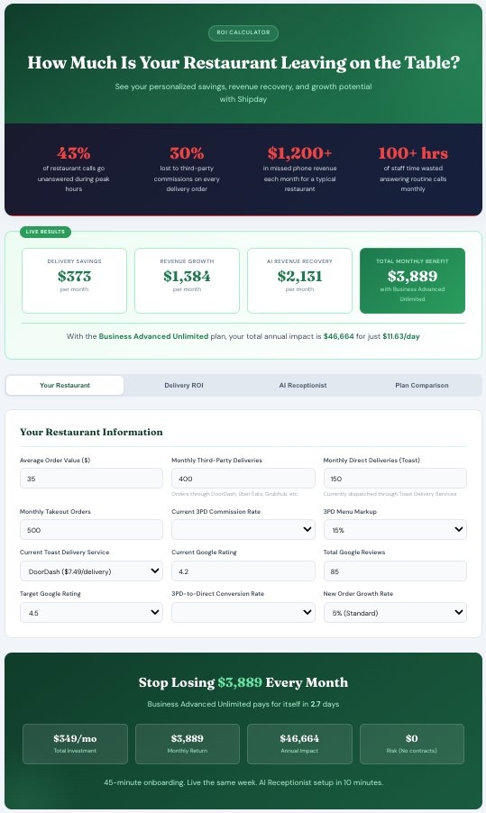
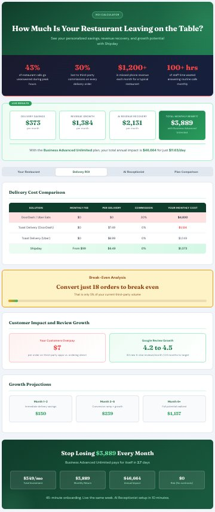
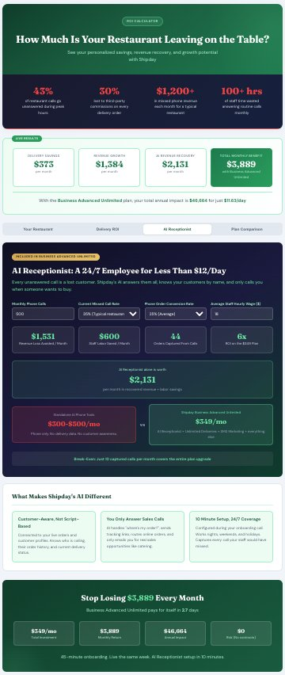
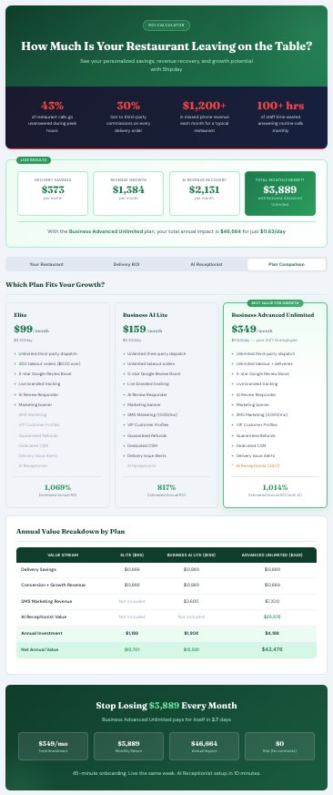

# Shipday ROI Calculator

An interactive ROI calculator built to help restaurant owners understand the full financial impact of switching to [Shipday](https://www.shipday.com) for delivery management, customer engagement, and AI-powered phone support.

**Live version:** [shipday.mikegrowsgreens.com](https://shipday.mikegrowsgreens.com/)

## Overview

This calculator gives restaurant operators a personalized breakdown of their potential savings, revenue recovery, and growth across three value layers:

- **Delivery cost savings** from replacing third-party commissions and Toast Delivery Services with Shipday's flat-rate dispatch
- **AI Receptionist revenue recovery** from capturing missed phone calls, reducing staff phone burden, and routing high-intent callers to direct orders
- **Growth projections** including Google review acceleration, SMS marketing impact, and third-party-to-direct order conversion over time

The tool is designed to support sales conversations and help prospects see the full value of Shipday's Business Advanced Unlimited plan ($349/month), which bundles delivery management, SMS marketing, and a 24/7 AI Receptionist into a single platform.

## Screenshots

### Restaurant Inputs
Customize every variable to match the prospect's actual operations. Average order value, delivery volume, commission rates, Google review data, and more.



### Delivery ROI
Side-by-side cost comparison against DoorDash, Uber Eats, and Toast Delivery Services. Includes break-even analysis and Google review growth timeline.



### AI Receptionist
Dedicated section quantifying the value of Shipday's AI Receptionist. Calculates missed call revenue recovery, staff labor savings, captured orders, and ROI multiplier. Compares standalone AI phone tools ($300-$500/month) against Shipday's bundled offering.



### Plan Comparison
Full feature and ROI comparison across Elite ($99), Business AI Lite ($159), and Business Advanced Unlimited ($349). Annual value breakdown makes the upgrade path clear.



## Key Metrics Calculated

- Monthly and annual delivery cost savings
- Third-party to direct order conversion value
- Toast Delivery Services replacement savings
- AI Receptionist missed call revenue recovery
- Staff labor savings from automated call handling
- Google review growth timeline to target rating
- Customer overpay analysis (direct vs. third-party pricing)
- Break-even order count
- Plan-specific ROI percentages
- Payback period in days

## Tech Stack

Single-file HTML/CSS/JavaScript. No dependencies, no build step. Drop it on any static host and it works.

- Custom CSS with CSS variables for theming
- DM Sans + Fraunces typefaces (Google Fonts)
- Vanilla JavaScript for all calculations and UI updates
- Responsive design (mobile-first)
- Tab-based navigation for focused conversation flow

## Deployment

This is a single `index.html` file. Host it anywhere that serves static files:

```bash
# Local preview
open index.html

# Or serve it
python3 -m http.server 8000
```

For production, deploy to any static hosting provider (Netlify, Vercel, GitHub Pages, Cloudflare Pages, or your own server).

## Context

Built as a sales enablement tool for Shipday account executives working with Toast restaurant partners. The calculator supports both self-service exploration and guided demo conversations, with a tab structure that maps to a natural sales flow:

1. **Your Restaurant** - Gather prospect data
2. **Delivery ROI** - Validate delivery savings (logical path)
3. **AI Receptionist** - Reveal hidden revenue loss (emotional path)
4. **Plan Comparison** - Close with clear upgrade justification

## License

Internal sales tool. Not for redistribution.
